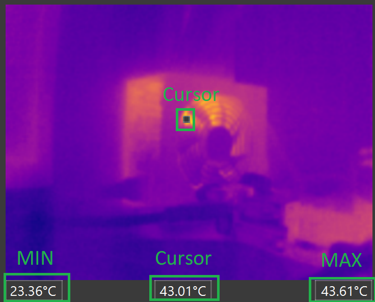

# Theia Desktop Application

This repository contains the companion desktop application for the Theia cameras. It communicates with the cameras via a Serial connection using a one-byte command set. It provides functionality to control the cameras, download and display data from them and analyze the radiometric data.  

The application is developed using python (PySide6). A Windows image is provided in a zip file. The application can be run directly from the unzipped directory by double clicking the application executable.

## Overview

The different controls are listed below.

 

## Usage

### Startup

Double clicking the application executable will start the app.

 

Note that most controls are disabled for now. They will be enabled once a successful connection to a camera is established.

### Connect a camera

Conncting a camera is a straight foward procedures; you need to first select a port com using the select com button (make sure it's the right one).

 

Then click on the connect button.

 

After a successful connection the remaining controls will be enabled.

 

### Camera Controls

The app tool bar, beside establishing a connection, it provides some basic controls. These buttons provide a way to send commands to the camera over the serial interface.

 

| **Control** | **Function** |
|------|------|
| Palette Button  | Opens a Colormap Select Dialog where the user can select one of the predefined colormaps and click on confirm to send "set colormap" command to the camera (The camera should change the colormap immediately)|
| Snap Button  | Sends "get raw data" command to the camera. Upon receiving the full image it will be displayed in Image Preview. |
| Save Button   | Opens a dialog to save the currently displayed image (as png). |
| FFC Button | Sends "run ffc" command to the camera. |
| Gain Button | Open a dialog to select a gain (High/Low/Auto) and sends "set gain" command to the camera upon confirming.  |
| Reboot Button | Sends "reboot" command to the camera.  |
| Reset Button | Sends "reset" command to the camera. |
| Info Button | Sends "get info" command to the camera and opens a dialog to display the received info. |

### Image Controls

The image preview section provides some info on the maximum & minimum temperatures (in °C) over the received image. You can also click anywhere on the image to select a spot and get the temperature. A cursor is dynamically drawn over the selected spot.

 

### Colormap Controls

Clicking on either the left or the right side of the colormap would load another one of the predefined colormpas. Right for next and Left for previous. The name of the selected colormap is displayed and the and the color theme is reapplied on the dislayed image and histogram.

 

### Histogram Controls

The histogram tool bar offers some basic control over the displayed figure.

 

more details about the controls can be found [here](https://matplotlib.org/3.2.2/users/navigation_toolbar.html).

