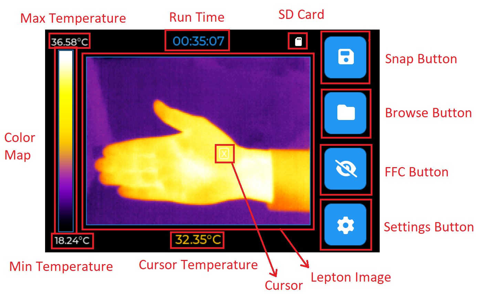
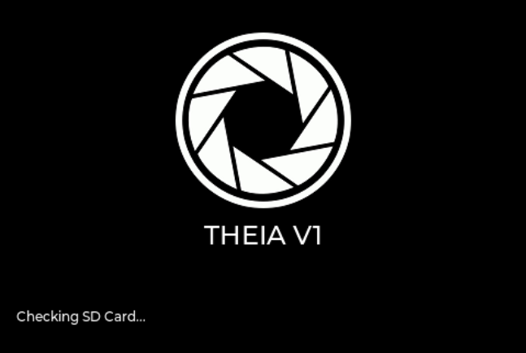
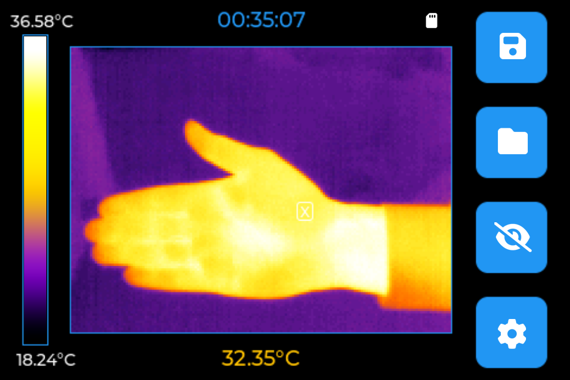
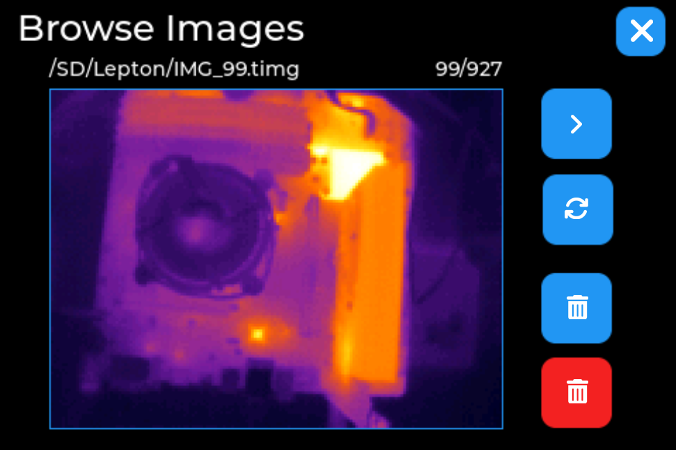
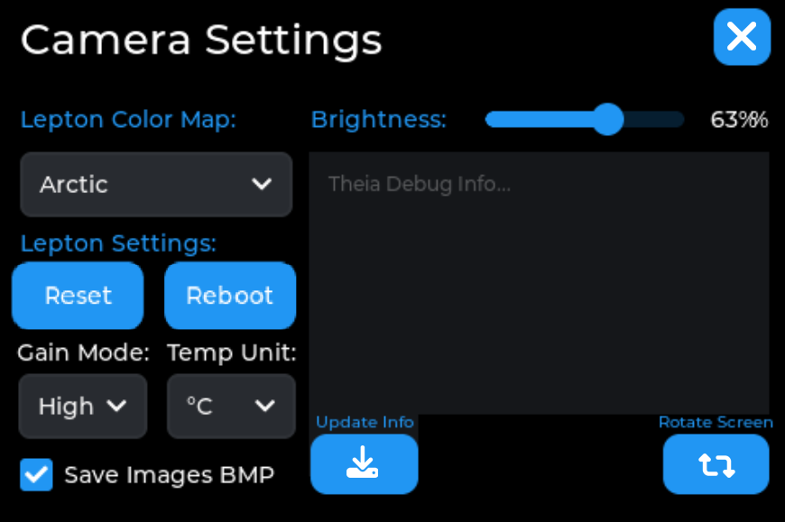

# Theia Thermal Camera - Firmware

Theia firmware V1 is an Arduino IDE project. You need to have the Arduino core for the ESP32 installed to build the firmware.  

## Dependencies 

[Display Driver] LovyanGFX 1.2.0 (a small modification needed for IPS Displays)  
[GUI] LVGL 8.3.0   
[Timer] ESP32Time 2.0.6  
[Status Led] FastLED 3.9.13  

## Operating

Theia can be controlled locally using the graphics user interface (Theia GUI) or remotely using a command-based interface (Theia Serial) available via USB. Both interfaces are detailed below.

### Theia USB Connector 1
The first USB Connector is used mainly for debug purposes (baud 115200) but it can be used to provide power to the camera. (By default the debug interface is disabled).

### Theia USB Connector 2
The USB connector is used to provide power to the camera and as a programming/control interface for Theia. This port is used by Theia Tool v1.0.0b to access the camera.

### Theia SD Card
Image files (RAW or BMP) are stored in the attached SD card. If none is attached the firmware will detect the absence of the SD Card and the user won't be able to save any images nor browse the content of the card.   Files are saved under RAW or BMP format (.timg or .bmp) after being scaled to 320x240.

## Theia GUI

 

### Boot Screen
 

### Main Screen 
 

### Browse Screen
 

### Settings Screen
 

## Theia Serial

Theia Serial inteface is meant for basic controls over the camera using the native USB (In CDC mode) on the ESP32-S3.  
The communication is simplistic and based on frames.

### Data Frame

| **SOF (0x00)** | **CMD ID** | **DATA** | **CRC** | **** | **** | **** | **** | **** | **** |
|----------------|------------|----------|---------|------|------|------|------|------|------|
|                |            |          |         |      |      |      |      |      |      |
|----------------|------------|----------|---------|------|------|------|------|------|------|

### Command list

| **Command** | **Description** |
|------|------|
|      |      |
|      |      |
|      |      |
|      |      |
|      |      |
|      |      |
|      |      |

## Authors

- [Che Ahmed](https://github.com/CheAhMeD)

## Badges

